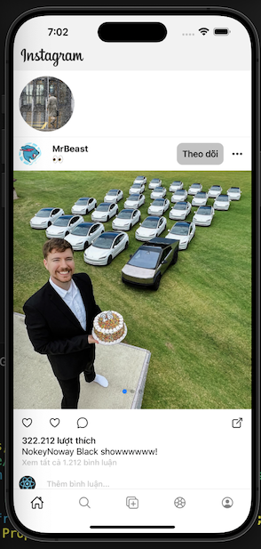

# Instagram App

InsApp is a React Native application that replicates key features of Instagram. It includes functionalities such as viewing reels and searching for users.

## Table of Contents

- [Introduction](#introduction)
- [Features](#features)
- [Getting Started](#getting-started)
  - [Prerequisites](#prerequisites)
  - [Installation](#installation)
- [Running the App](#running-the-app)
- [Testing](#testing)
- [Folder Structure](#folder-structure)
- [Contributing](#contributing)
- [License](#license)
- [Contact](#contact)

## Introduction

InsApp is a mobile application developed using React Native, aiming to provide a seamless user experience similar to Instagram. Users can view engaging short video reels and search for other users within the app.


## Features

- View Reel&Post
- Search User
- Animation
- UnitTest (search screen)

## Getting Started
  - Add config key in ./src/services/configs.json
  - Register data in [Rappid API](https://rapidapi.com/social-api1-instagram/api/instagram-scraper-api2): 
  `` 
  {
    "baseURL": "https://instagram-scraper-api2.p.rapidapi.com",
    "apiKey": "f71e549a9dmshfbb0ac22addfd31p14893fjsn6c4b9c9da8b7",
    "apiHost": "instagram-scraper-api2.p.rapidapi.com"
  }
  ``

### Prerequisites

Ensure you have the following installed:

- [Node.js](https://nodejs.org/)
- [npm](https://www.npmjs.com/) or [Yarn](https://yarnpkg.com/)
- [React Native CLI](https://reactnative.dev/docs/environment-setup)
- [Xcode](https://developer.apple.com/xcode/) (for iOS development)
- [Android Studio](https://developer.android.com/studio) (for Android development)

### Installation

Clone the repository and install the dependencies:

```sh
git clone https://github.com/leanhforevo/Instagram-App.git
cd Instagram-App
npm install
# or if you use Yarn
yarn install
```

## Running the App

### iOS

Run the following command to start the iOS app:

```sh
npx react-native run-ios
```

### Android

Run the following command to start the Android app:

```sh
npx react-native run-android
```

Ensure you have an Android emulator running or a device connected.

## Testing

To run the tests, use:

```sh
npm test
# or if you use Yarn
yarn test
```

## Folder Structure

Provide a brief explanation of the project folder structure:

```
MyReactNativeApp
├── android             # Android specific code
├── ios                 # iOS specific code
├── src                 # Source code
│   ├── components      # Reusable components
│   ├── views         # Application screens
│   ├── navigation      # Navigation configuration
│   ├── services        # API services
│   ├── store           # State management (not yet)
│   ├── utils           # Utility functions
│   └── index.tsx         # Entry point
├── __tests__           # Test files
├── package.json        # Project dependencies
└── README.md           # Project documentation
```


## Contact

If you have any questions, feel free to reach out:

- Email: leanhforevo@gmail.com.com
- GitHub: [leanhforevo](https://github.com/leanhforevo)
